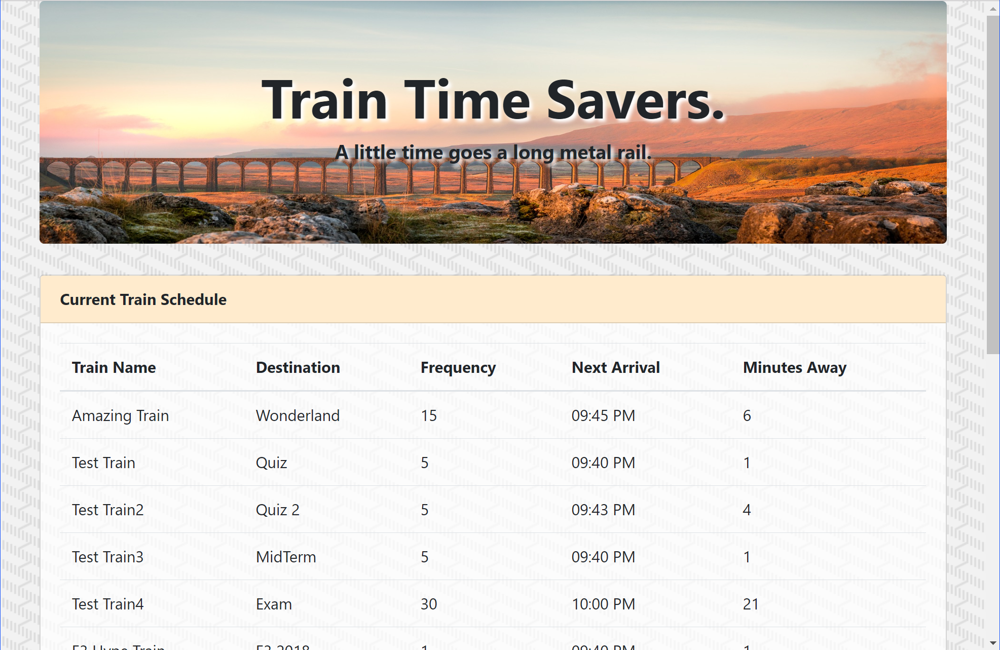

# Train_Scheduler

## Link: https://ericng314.github.io/Train_Scheduler/

## About

Example of firebase as a cloud database to write, retrieve, and update information in realtime. Including usage of moment.js for time calculations.

### JavaScript examples of:
- Assigning values using jQuery
- Applying user input using jQuery
- Listening for user clicking using jQuery
- Utilizing cloud storage data.
  - Input information to firebase.
  - Updating page when an event occurs in firebase.
  - Pulling information from firebase.
- Output to an html document with specified ID using jQuery
- Creating and calling functions
- Appending elements.
- Moment.js for time calculations.

### CSS examples:
- Applying online fonts.
- Transparent backgrounds.
- Bootstrap styling for images, buttons, containers, and rows.

## Built With

- HTML (Hypertext Markup Language)
- CSS (Cascading Style Sheet)
- Bootstrap v4.1
- JavaScript
- jQuery
- Firebase

## Authors
- Eric Ng

## License
This project is licensed under the MIT License - see the LICENSE.md file for details